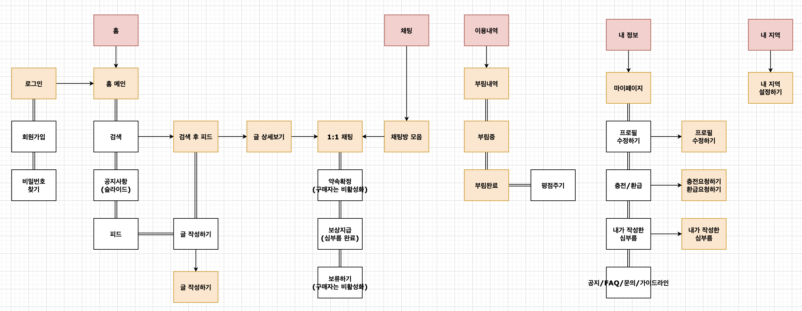
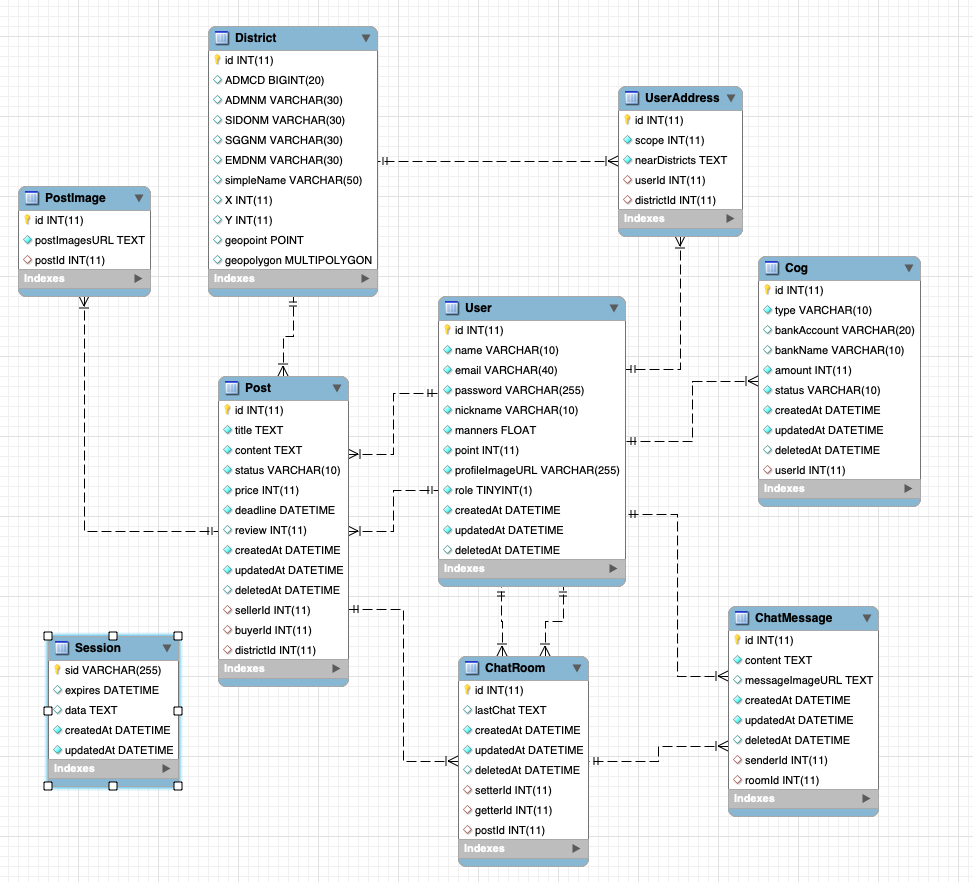

## 부름부름 서버 (broom-broom-server)

[이전 부름부름 서버](https://github.com/Yooncoding/broom-broom-server)

### 개요

프로젝트이름은 **부름부름**이고 **사용자는 의뢰인과 피의뢰인으로 간단한 심부름을 하고 보상을 지급받는 O2O서비스**입니다. 빠른 심부름을 위해 지역 기반 서비스로 제작하였습니다.

### 주요기능

어플에서 의뢰인은 **부리미**, 피의뢰인은 **부르미**라고 지칭하겠습니다.

- 미션 등록: 원하는 심부름 업무를 서술식으로 등록합니다.
- 회원 가입: 회원 가입, 로그인, 비밀번호찾기, 이메일인증 등을 구성합니다.
- 평점 기능: 심부름 후 부리미가 만족도를 평가합니다.
- 미션 수행: 의뢰를 수락하고 심부름을 진행합니다.
- 정산 기능: 심부름 후 포인트를 받습니다.
- 채팅 기능: 부리미가 약속잡기와 보상지급을하고 심부름에대한 자세한 설명을 해줍니다.
- 지역 기능: 회원이 사는 지역설정과 범위설정으로 활동지역을 설정합니다.

### 구조도



### Directory

```
src
 ├── api
 │   ├── controllers
 │   ├── middlewares
 │   │   ├── auth
 │   │   ├── multer
 │   │   └── validators
 │   └── routes
 ├── config
 ├── loaders
 ├── models
 ├── services
 ├── utils
 └── server.js
```

### Database



### API

- **명세표**

  [View API document](https://documenter.getpostman.com/view/13108520/U16etnJZ#intro)

- **response format**

```json
{
  "suc": boolean // true면 정상반환, false면 비정상 반환
  "mes": string
  "data": any // default -> "data": null
}
```

### 실행

- 깃허브 코드 클론

```
git clone https://github.com/Yooncoding/Broom-Broom-refactoring-server.git
```

- 패키지 설치

```
npm install
```

- 환경변수 설정

```
.env.sample 파일 확인
```

- 실행

```
npm run dev
```
